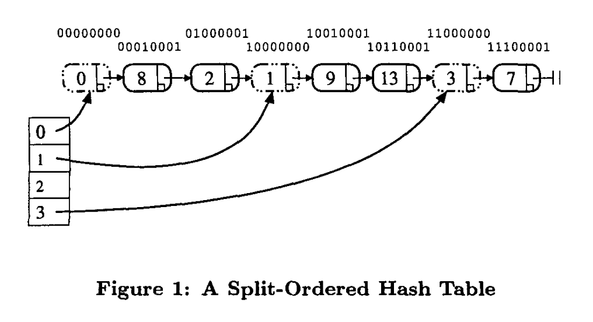

只看理论章节，证明和分析章节暂时不看：

## Recursive split-ordering

提出的哈希表由两个相连接的子结构构成：

* 一个包含有序 item 和 key 的链表结构。
* 一个指向链表结构的可拓展数组。

加倍扩容的过程中$2 ^ i\ ——\ 2 ^{i + 1}$，原本只在$b \equiv x \pmod{ 2 ^ i}$会分散到$b, b + 2 ^ i$两个桶中，

在`ordered-list`中，只需要按照`reverse(key)`进行排序，可以将$b, b + 2 ^ i$的`hash-key`放在`list`的连续位置中。

分为两种节点，`dummy`如图中虚线的部分不含有实际的`key-value`，另一种如图中的实线部分含有实际的`key-value`

两种节点的`hash-value`通过`reverse(key) << 1`，在末尾标识`0 or 1`进行排序区分。

通过这种布局，我们在增长`resize`的时候，对于上述的过程中，只需要调整`bucket[b + 2 ^ i]`所指向的`dummy-node`即可。

下面展示了一个`hash-table`如何从`bucket-size = 2`变成`bucket-size = 8`的过程：

所有的节点都按照`reverse(key) << 1 & (0 or 1)`进行排序，桶的索引是根据`key & (size - 1)`得到的。

